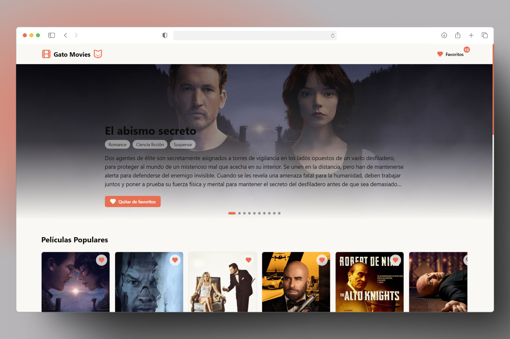
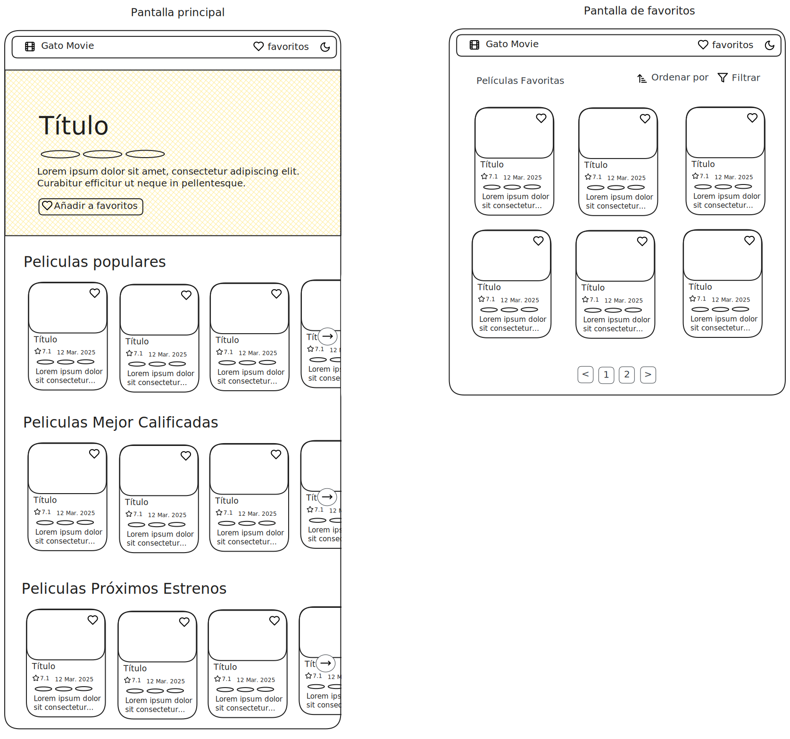

# reto-frontend-gato

## Descripción

El proyecto **reto-frontend-gato** es un reto técnico desarrollado para el proceso de selección al puesto de Frontend Trainee en Gato. Su objetivo es construir una Single Page Application (SPA) que consuma la API de [The Movie Database (TMDB)](https://developer.themoviedb.org/docs/getting-started) para mostrar información y detalles de películas.

La aplicación permite:

- Visualizar un carrusel interactivo de películas en cartelera.
- Consultar tres secciones de películas:
  - **Populares**
  - **Mejor calificadas** (con scroll infinito para cargar más contenido)
  - **Próximos estrenos**
- Marcar películas como favoritas a través de un icono de corazón.
- Acceder a una página de favoritos que incluye filtros de ordenamiento, filtros por género, botón de refrescar y paginación cuando se superan las 12 películas.

## Demo



Puedes ver la aplicación en vivo en: [https://reto-frontend-gato.vercel.app/](https://reto-frontend-gato.vercel.app/)

## Tecnologías Utilizadas

- **React** con **Vite** y **TypeScript**
- **react-router** para la navegación de la SPA
- **axios** para el consumo de la API
- **tanstack** para el manejo de peticiones y caché
- **shadcn** y **zustand** para el manejo de la UI y estado
- **Tailwind CSS** y **lucide-react** para estilos e íconos
- **Bun** para la gestión de dependencias y ejecución
- **Docker** (opcional) para despliegue en contenedor

## Wireframe y Diseño


Se utilizó Excalidraw para realizar el wireframe de la aplicación. El diseño es sencillo y minimalista. Puedes ver el diseño en el siguiente enlace: [Wireframe en Excalidraw](https://excalidraw.com/#json=BsvMQ8HLOplkwJ2W-UoJa,WIsJiky19pqfQBr4MjVqrw).

## Estructura del Proyecto

El proyecto se organiza en 4 módulos principales:

- **common:** Componentes y utilidades comunes (por ejemplo, la página _NotFoundPage_).
- **movie:** Todo lo relacionado a una única película, incluyendo la vista de detalles (_MoviePage_) y componentes como _MovieCard_.
- **movies:** Gestión del conjunto de películas, incluyendo:
  - Carrusel de cartelera.
  - Listas de películas: populares, mejor calificadas (scroll infinito) y próximos estrenos.
  - Página de favoritos, con filtros, botón de refrescar y paginación.
- **router:** Configuración principal de rutas. El archivo `TMBDRouter.tsx` define las siguientes rutas:
  - `/` → Página principal (_HomePage_)
  - `/movie/:id` → Detalle de una película (_MoviePage_)
  - `/favorites` → Página de favoritos (_FavoritesPage_)
  - `*` → **Redirecciona automáticamente a `/`** en rutas no definidas

Router principal:

```tsx
import { BrowserRouter, Navigate, Route, Routes } from 'react-router';
import { MainLayout } from '@/movies/layouts/MainLayout';
import { MoviePage } from '@/movie/pages/MoviePage';
import { HomePage } from '@/movies/pages/HomePage';
import { FavoritesPage } from '@/movies/pages/FavoritesPage';

const TMBDRouter = () => {
  return (
    <BrowserRouter>
      <Routes>
        <Route element={<MainLayout />}>
          <Route path="/" element={<HomePage />} />
          <Route path="/movie/:id" element={<MoviePage />} />
          <Route path="/favorites" element={<FavoritesPage />} />
        </Route>
        <Route path="*" element={<Navigate to={'/'} />} />
      </Routes>
    </BrowserRouter>
  );
};

export default TMBDRouter;
```

El componente **Navbar** se encuentra en el layout principal (_MainLayout_) y permite navegar a la página de favoritos o regresar a la página principal al hacer clic en el logo.

## Instalación y Ejecución

### Requisitos Previos

- Tener instalado **Node.js**.
- Instalar **Bun** globalmente si no lo tienes:
  ```bash
  npm install -g bun
  ```

### Configuración de Variables de Entorno

Tanto para la ejecución local como para Docker, es necesario configurar las variables de entorno. Renombra el archivo `env.example` a `.env` y agrega las siguientes variables:

```env
VITE_MOVIE_DB_KEY=
VITE_MOVIE_DB_URL=
```

### Instalación en Local

1. **Clonar el repositorio:**

   ```bash
   git clone https://github.com/S4vi0r17/reto-frontend-gato
   cd reto-frontend-gato
   ```

2. **Instalar dependencias:**

   ```bash
   bun install
   ```

3. **Ejecutar en modo desarrollo:**
   ```bash
   bun dev
   ```
   La aplicación se ejecutará en el puerto que indique Bun (por defecto suele ser `http://localhost:5173/`).

### Uso de Docker

Si prefieres utilizar Docker:

1. **Asegúrate de tener configuradas las variables de entorno** en el archivo `.env` (como se indica en la sección anterior).

2. **Construir la imagen Docker:**

   ```bash
   docker build -t reto-frontend-gato .
   ```

3. **Ejecutar el contenedor:**

   ```bash
   docker run -p 8080:80 reto-frontend-gato
   ```

4. **Acceder a la aplicación:**
   Abre tu navegador en [http://localhost:8080/](http://localhost:8080/)

## Funcionalidades Destacadas

- **Carrusel de Cartelera:** Visualización interactiva de películas en cartelera.
- **Listas de Películas:** Se presentan tres secciones: populares, mejor calificadas (con scroll infinito) y próximos estrenos.
- **Marcado de Favoritos:** Cada película incluye un icono de corazón para marcarla como favorita.
- **Página de Favoritos:** Permite ver todas las películas marcadas como favoritas, aplicar filtros de ordenamiento y género, refrescar la lista y utilizar paginación cuando se superan las 12 películas.
